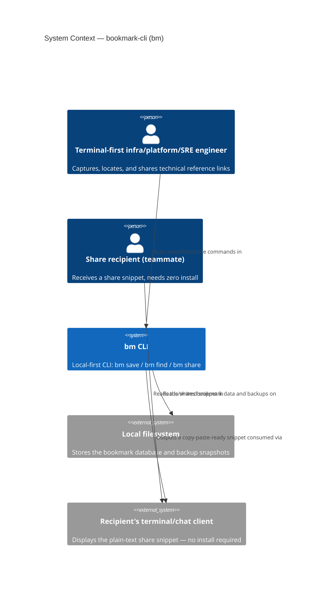
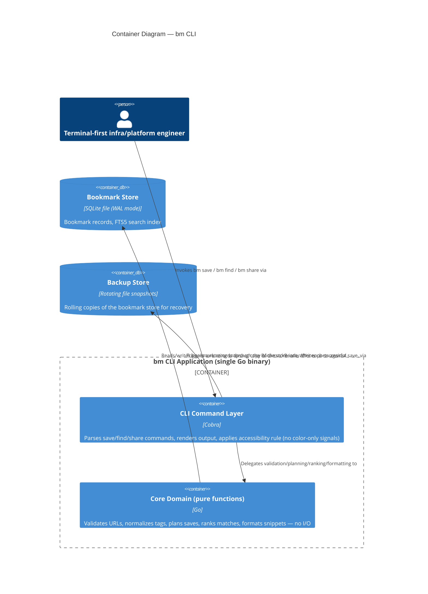
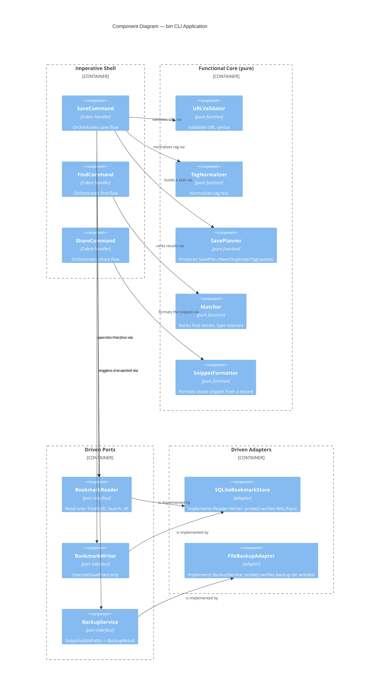

# Architecture Brief: bookmark-cli

Status: DESIGN wave in progress | Architect: Morgan (nw-solution-architect) | Date: 2026-08-07
First architect on this brief — no prior `## System Architecture` (Titan) or `## Domain Model`
(Hera) sections exist. This document starts at `## Application Architecture`.

Interaction mode: **Propose** (per `/nw-design` Decision 1) — options presented below with
trade-offs, recommendation made, converging with user before COMMIT.

---

## Application Architecture

### 0. Carried-Forward Risk: Feasibility of "Local-First, No Server Infrastructure"

DISCUSS wave (`docs/feature/bookmark-cli/discuss/wave-decisions.md`) explicitly flagged this as
an **unverified assumption**, not a closed decision, following DISCOVER's G4 FAIL (feasibility
risk unaddressed — "RED — NOT ASSESSED... no technical spike run").

**DESIGN-level feasibility analysis (this wave's contribution to closing that risk):**

Every component in the architecture below (CLI binary, embedded SQLite file, filesystem-based
backup snapshots, plain-text copy-paste share snippet) is achievable with zero network calls and
zero server-side component. There is no point in the design where a server, account system, or
network round-trip is structurally required:
- `bm save`/`bm find` operate entirely against a local embedded database file.
- `bm share` generates a snippet by string-formatting an already-resolved local record — no
  network call, no shortened-link service, no server-side rendering.
- Backup/recovery (Section 10) is filesystem-to-filesystem, no remote target required for MVP.

**Conclusion: the *technical feasibility* component of DISCOVER's G4 RED finding is CLOSED by
this design** — nothing here requires infrastructure that doesn't exist. What remains open and
is explicitly **NOT** closed by DESIGN: the *channel/viability* risk (distribution economics,
Homebrew/GitHub reach, willingness-to-pay) — that is a go-to-market question, out of
solution-architect's scope, and stays flagged for business/DEVOPS review. This distinction is
recorded so "local-first" is not silently promoted to "fully verified" — only its engineering
feasibility is verified here.

---

### 1. Quality Attribute Priorities (drives every decision below)

Sourced from `docs/feature/bookmark-cli/discuss/outcome-kpis.md` and the NFR Guardrails in
`user-stories.md`:

| Attribute | Requirement | Source |
|---|---|---|
| Performance (save) | <100ms perceived confirmation | KPI, US-01 |
| Performance (find) | <10s including no-match, responsive up to **10,000 bookmarks** (target set here — no upper bound was previously stated) | KPI, US-02/US-06 |
| Reliability | Local store is a SPOF; backup/recovery approach required before MVP | NFR Guardrail |
| Concurrency | `save`/`find`/`share` may run concurrently from multiple panes/scripts against the same store; atomic-write-at-minimum | NFR Guardrail |
| Accessibility | No ANSI-color-only status indicators | NFR Guardrail |
| Usability | `--tag` flag discoverable in <10s (was ~20s) | US-04, KPI 4 |
| Portability | Zero-install for `bm share` recipients (hard guardrail) | US-03, KPI 3 |
| Testability | Business logic isolated from I/O for fast, deterministic tests | Core Principle 2/12 |
| Maintainability | Solo/small team, time-to-market matters — simplest defensible design | Constraint |
| Security | No account/auth system exists (no required account creation, per System Constraints); data at rest is protected by OS filesystem permissions on `${data_dir}` (no shared-tenant access, no network listener, no external attack surface). No encryption-at-rest or authentication is required for MVP — closed explicitly here (added after peer review) rather than left implicit, since a local-first architecture with zero network calls and zero multi-user access has no threat model beyond "another local OS user/process with filesystem access," which standard OS file permissions already address. Revisit if a future release introduces shared/synced storage. | Peer-review addition (2026-08-07) |

### 2. Team Structure (Conway's Law Check)

Solo/small-team maintenance (per DISCOVER Lean Canvas "Cost Structure"). No multi-team split
exists or is anticipated. **Conway's Law: not a constraint at this scale** — single deployable
binary, single owner, no service boundary needed for team-topology reasons. This rules out
microservices independent of any other factor (team size alone, per Core Principle 8, already
disqualifies it).

---

### 3. Technology Selection (Propose Mode — Options + Recommendation)

#### 3.1 Language / Runtime

| Option | Startup latency | Distribution | Concurrency/FS primitives | Ecosystem fit for infra persona | License |
|---|---|---|---|---|---|
| **A. Go** | ~1-5ms cold start, compiles to single static binary | `go install`, Homebrew tap, GitHub release binaries — no runtime dependency | Excellent (`flock`, goroutines, mature SQLite drivers incl. pure-Go/no-cgo) | Native fit — kubectl/docker/terraform-adjacent toolchain the persona already trusts | BSD-3 (Go itself) |
| B. Rust | ~1-5ms cold start, single static binary | `cargo install`, Homebrew, binaries | Excellent, strongest compile-time safety guarantees | Good fit, steeper learning curve raises solo-maintainer velocity risk | MIT/Apache-2.0 |
| C. Python | 30-80ms interpreter+import startup before any work happens | `pip install` requires a Python runtime present — friction for zero-dependency CLI expectation | Adequate but GIL-era stdlib flock semantics less battle-tested for CLI tools | Fast to write, weaker "single binary, no runtime" fit for infra tooling norms | PSF |

**Trade-off analysis (high-stakes, irreversible-ish choice — warrants inline reasoning even
under lean density):** the <100ms perceived-save-confirmation KPI is a hard budget that has to
cover process startup + storage I/O + terminal write. Python's interpreter/import overhead alone
(30-80ms) consumes a large fraction of that budget before any actual work happens, and pip-based
distribution reintroduces exactly the kind of "recipient needs something installed" friction the
persona has already rejected for `bm share` (the same value applies to installing `bm` itself
for a terminal-first engineer who wants `brew install bm` to just work). Rust and Go are both
viable on performance/distribution; Rust's steeper learning curve is a real solo-maintainer
velocity risk (Core Principle 8: simplest solution first, team capability match) with no offsetting
requirement here for Rust's stronger compile-time guarantees (no unsafe memory operations, no
FFI, no exotic concurrency primitives needed for this scope).

**Decision: Go — CONFIRMED.** Meets the startup-latency budget, distributes as a single static
binary matching the persona's existing tool expectations (kubectl, terraform, docker), and has a
lower solo-maintainer learning-curve risk than Rust for a scope this size. See ADR-001
(Accepted).

Confirmed final by the user (2026-08-07) — this was the one choice explicitly open going into
this session and is now settled.

#### 3.2 Storage Format

| Option | Concurrency safety | Fuzzy/tag search | Reliability/backup story | Complexity added |
|---|---|---|---|---|
| **A. SQLite (embedded, pure-Go driver)** | WAL mode + `busy_timeout` gives real atomic-write and multi-process-safe reads/writes out of the box | FTS5 extension gives native ranked full-text + trigram-style fuzzy matching | Single file, trivially copyable for snapshot backup; ACID means no half-written records | Adds a storage-engine dependency (mitigated: pure-Go driver, no cgo, no external service) |
| B. JSON file (whole-file read/rewrite) | Requires manual advisory locking (`flock`) + write-to-temp-then-atomic-rename; correct but hand-built | No index — linear scan + in-process fuzzy-match library; at 10k records still well under 10s, but no ranking primitive for free | Single file, easy to copy; no ACID — an interrupted rewrite before the atomic rename completes is safe, but if the app is killed mid something less standard, less proven than SQLite's WAL | Zero new binary dependency, but hand-rolled locking/atomicity code is exactly the kind of "convention not contract" surface Core Principle 13 warns against |
| C. BoltDB/bbolt (embedded KV) | Built-in single-writer/multi-reader locking, ACID via B+tree | No native full-text/fuzzy search — would need to build indexing by hand on top of a KV store | Single file, ACID | Reinvents what SQLite+FTS5 already provides, for no benefit over option A at this scale |

**Recommendation: SQLite** with a pure-Go driver (`modernc.org/sqlite` — no cgo, keeps the
single-static-binary distribution story intact) in WAL mode. It directly satisfies the
concurrency NFR guardrail (atomic-write-at-minimum) as a *contract of the engine*, not a
hand-rolled convention — this matters under Core Principle 13 (Earned Trust): a probe can verify
WAL mode is actually honored by the filesystem (some overlay/network filesystems silently
degrade WAL/fsync guarantees), whereas a hand-rolled `flock`+rename scheme has more surface area
that quietly diverges from its contract under load. FTS5 gives ranked, typo-tolerant search
(US-02 AC) without hand-building a ranking algorithm. See ADR-002.

#### 3.3 CLI Framework

| Option | Convention fit | "did you mean" flag correction (US-04) | Maturity/license |
|---|---|---|---|
| **A. Cobra (spf13/cobra)** | Same framework used by kubectl, Docker CLI, Terraform CLI — persona already has muscle memory for its help/flag conventions | Built-in command-suggestion support; flag-level "did you mean" needs a small custom layer either way | Mature, MIT, very large community |
| B. urfave/cli | Simpler API, smaller footprint | No built-in suggestion support | Mature, MIT, smaller community than Cobra |
| C. Kong | Declarative struct-tag based | No built-in suggestion support | Smaller community, MIT |

**Recommendation: Cobra.** The persona's existing tools (kubectl/docker/terraform) all use Cobra
conventions, which lowers the learning curve for `bm --help` on first use — directly supports
US-04's discoverability goal. See ADR-003.

---

### 4. Architecture Pattern

**Modular monolith, hexagonal (ports-and-adapters), with Functional Core / Imperative Shell**
(Core Principle 12). Single deployable binary; one bounded context (confirmed in DISCUSS Scope
Assessment: "1 bounded context — local bookmark store + CLI surface"). Microservices, event
sourcing, and CQRS are all rejected as disproportionate to a 3-command, single-user-process CLI
— documented as rejected simpler-first alternatives are the *default* here already (Core
Principle 8: default = modular monolith, no escalation trigger fired: team is 1, no independent
deployment requirement exists).

Rejected complexity, briefly: event sourcing/CQRS would add an audit-trail capability nobody
asked for (no story requires "why was this saved" history); microservices would add process/IPC
overhead with no team-topology or scaling justification (Section 2).

---

### 5. Component Architecture & Contract Shape Classification

Per Core Principle 12 (Effect Isolation by Design), every component below is classified by
contract shape — pure-function (return-only), bounded-change (declared mutation set), or
unbounded-preservation (must return a Plan, never mutate directly).

| Component | Layer | Contract Shape | Mutation Universe (if any) | Assertion Mechanism |
|---|---|---|---|---|
| `URLValidator.Validate(url) -> ValidationResult` | Core (pure) | pure-function | none | unit test, no I/O |
| `TagNormalizer.Normalize(tag) -> NormalizedTag` | Core (pure) | pure-function | none | unit test, property-based (idempotency: `normalize(normalize(x)) == normalize(x)`) |
| `DuplicateDetector.Check(url, existing []Record) -> DuplicateVerdict` | Core (pure) | pure-function | none (reads a supplied slice, returns a verdict, never queries storage itself) | unit test |
| `SavePlanner.Plan(url, tag, existing []Record) -> SavePlan{New\|Duplicate\|TagUpdate}` | Core (pure) | pure-function (Plan-value pattern) | none — returns a `SavePlan` describing intended mutation, never performs it | unit test; this is the component directly modeled on the mandate's `dry_run(cfg) -> InstallPlan` example |
| `Matcher.Rank(query, candidates []Record) -> RankedMatches` | Core (pure) | pure-function | none | unit test, property-based (ranking stability) |
| `SnippetFormatter.Format(record) -> ShareSnippet` | Core (pure) | pure-function | none | unit test |
| `BookmarkReader` (driving-adjacent port, read-only) | Port | pure read (bounded-change EXCLUDED by design) | N/A — interface exposes only `FindByID`, `Search`, `All` — **no write methods**, per Core Principle 12's read/write port-splitting rule | compile-time: interface has no mutating methods |
| `BookmarkWriter` (port) | Port | bounded-change | single-row insert/update in the `bookmarks` table, executed only via `Execute(plan SavePlan)` | integration test against real SQLite adapter |
| `SQLiteBookmarkStore` (adapter, implements Reader+Writer) | Driven adapter | bounded-change (Writer side) / pure-read (Reader side) | bounded to the `bookmarks` table in the configured DB file | probe() — see Section 12; integration tests |
| `BackupService` (port) | Port | bounded-change | bounded to the backup directory only — never touches the primary DB file directly, only reads it to copy | integration test |
| `FileBackupAdapter` (driven adapter) | Driven adapter | bounded-change | creates/rotates files under `${data_dir}/backups/` only | probe() — see Section 12 |
| `SaveCommand`/`FindCommand`/`ShareCommand` (Cobra handlers) | Imperative shell | bounded-change (orchestration only, no business logic) | wires core + ports, no direct I/O beyond delegating to ports | acceptance tests (DISTILL wave) |

**Read/write port split enforced**: `BookmarkReader` (used by `find`/`share`, which must never
mutate) exposes zero write methods — `bm find` and `bm share` are structurally incapable of
writing to the store, closing exactly the bug class this principle exists to prevent.

**Plan-value pattern applied to the save/dedup flow (US-05 scenario 3)**: "offered to add the
tag to the existing entry" is modeled as `SavePlanner.Plan(...) -> SavePlan`, a pure decision
returned as data (`New` / `Duplicate` / `TagUpdate`), with `BookmarkWriter.Execute(plan)` as the
only impure step. This makes "duplicate detection silently wrote a second row" structurally
impossible — the exact bug class the mandate is designed to prevent (v3.15.1 dry-run bug
precedent).

---

### 6. C4 Diagrams

#### 6.1 System Context (L1)

No external system/API dependency exists (confirmed in Section 0). Nothing here is annotated
for contract testing — there is no external integration to contract-test against.

#### 6.2 Container (L2)

#### 6.3 Component (L3) — bm CLI Application container

Included because the container above decomposes into 8+ internally significant components with
distinct contract shapes (Section 5) — the effect-isolation boundary is exactly the kind of
detail C4 L3 exists to make visible.

---

### 7. Concurrency & Atomicity Design

- SQLite in **WAL (write-ahead log) mode** with `busy_timeout` set (e.g. 5000ms), satisfying the
  NFR guardrail's atomic-write-at-minimum requirement as an engine-level contract rather than
  hand-rolled locking.
- Multiple concurrent `bm save`/`bm find`/`bm share` invocations from different terminal panes
  are safe: WAL mode allows concurrent readers with a single writer; writers queue behind
  `busy_timeout` rather than failing outright or corrupting data.
- This is a claim that MUST be empirically probed, not assumed — see Section 12 (Earned Trust).

### 8. Data Reliability / Backup & Recovery Design

Addressing the NFR Guardrail directly (local storage is a SPOF):

- **Automatic rotating snapshot**: after each successful `bm save`, `FileBackupAdapter` copies
  the current DB file to `${data_dir}/backups/bookmarks-<timestamp>.db`, retaining the last 5
  snapshots (oldest rotated out). At the 10,000-bookmark target scale, the DB file is expected to
  remain in the low single-digit MB range, making a copy-per-save cheap enough to stay within the
  perceived-<100ms save budget (the snapshot copy happens after the confirmation is already
  printed — see Section 11 ordering note).
- **Manual backup documented**: `bm --help`/README documents `${data_dir}` location explicitly so
  users can fold it into their own backup/sync tooling (dotfiles repo, Time Machine, etc.) — the
  "even manual" floor the guardrail requires, satisfied as a documented fallback on top of the
  automatic snapshot, not instead of it.
- **Recovery path**: a future `bm restore --from <snapshot>` command is noted as an **open
  question deferred to DELIVER** (Section 15) — MVP ships with the snapshot files present and
  manually restorable (copy file back into place) even without a dedicated restore command.

### 9. Accessibility Design Rule

Confirmed per the NFR guardrail: no mockup or scenario in this pass uses color as the sole
carrier of meaning. Binding rule for the CLI Command Layer: **every status/error output carries
a text prefix** (`Saved`, `already saved as`, `no matches found`, `Error:`) independent of any
ANSI color used for decoration. Color, if added in a later release, is additive only — never the
sole signal. This is enforceable at the output-rendering layer as a lint rule (grep for raw
ANSI color codes not paired with a text-prefix helper) — flagged for platform-architect/CI as a
future automated check, not required for MVP acceptance.

### 10. Resource Scaling Target

**Target: responsive (sub-second query latency) up to 10,000 bookmarks**, comfortably inside the
<10s find KPI. SQLite+FTS5 typically resolves indexed full-text queries over 10k rows in single-
digit milliseconds; this target is set explicitly here because outcome-kpis.md's <10s figure had
no stated upper bound. Re-evaluate if usage data during the pilot shows store sizes approaching
this ceiling.

---

### 11. Earned Trust: Probe Contracts per Driven Adapter

Every driven adapter specifies a `Probe() error` method run at composition-root startup ("wire
then probe then use"). A probe failure causes `bm` to refuse the operation with a structured
`health.startup.refused` message rather than attempting a write that might silently fail — this
directly closes the class of bug the mandate targets (v3.15.1 dry-run precedent).

| Adapter | Probe scenario(s) | Fault injection it must survive |
|---|---|---|
| `SQLiteBookmarkStore` | (1) DB file/directory creatable and writable; (2) WAL mode actually engages (`PRAGMA journal_mode` returns `wal`, not silently falling back); (3) a write+fsync+read-back round-trip on a throwaway row actually persists | Read-only filesystem (permission denied), WAL unsupported by the underlying FS (e.g. some network/overlay filesystems silently downgrade WAL — this is the exact class of substrate lie flagged in the mandate's Docker overlayfs/WSL2 DrvFs examples), disk full during write |
| `FileBackupAdapter` | (1) backup directory creatable/writable; (2) copy-then-checksum round-trip of a throwaway snapshot succeeds; (3) rotation correctly deletes the oldest file even under concurrent access | Backup directory unwritable, disk full mid-copy (must fail safe — leave the primary DB file untouched, never partially write a corrupt snapshot and call it success) |

**Startup-latency note**: the probe run on every invocation is the *cheap* subset (stat +
touch-file + `PRAGMA journal_mode` check — microseconds), not the full fault-injection suite.
The full fault-injection scenarios above run in CI as the behavioral layer (next section), not
on every `bm` invocation — this keeps the probe compatible with the <100ms save budget.

### 12. Architecture Enforcement Tooling

Three semantically orthogonal enforcement layers (Core Principle 13c):

1. **Subtype check (compile-time)**: Go's structural interface typing enforces that
   `SQLiteBookmarkStore` satisfies `BookmarkReader`/`BookmarkWriter` and `FileBackupAdapter`
   satisfies `BackupService` at compile time — the Go-native equivalent of mypy+Protocol. No
   additional tooling needed for this layer; the compiler is the enforcer.
2. **Structural check (AST-walking pre-commit hook)**: a Go `go/ast`-based script (or
   `ruleguard`/custom `golangci-lint` rule) that walks every type implementing a driven-adapter
   interface and asserts a `Probe() error` method is present. This is the layer that catches "the
   adapter compiles and satisfies the interface but someone forgot to wire in a real probe" —
   `import-linter` was considered and **rejected**: it is a Python-only tool and, even setting
   language aside, its contracts are import-graph-only with no API for method-presence
   enforcement on types, which is exactly the check this layer needs. `go-arch-lint`/`depguard`
   are recommended instead for the separate, narrower job of enforcing package-import direction
   (domain must not import adapters) — a different question than method-presence.
3. **Behavioral check (CI gold-test runner)**: `go test ./... -tags=faultinjection` exercises the
   catalogued substrate lies from Section 11 (read-only tmpfs mount, simulated disk-full via a
   size-capped tmpfs, permission-denied directories) against the real adapters in CI.

**Self-application**: a fourth, narrow test in the behavioral suite verifies that `Probe()` on
each adapter is actually exercised at composition-root startup (not merely defined and never
called) — catching "adapter claims a probe but startup never invokes it."

**Package-boundary enforcement** (Core Principle 11, general dependency-inversion compliance):
`go-arch-lint` (OSS, MIT) configured so `internal/core` (pure functions + `SavePlan`/domain
types) has zero imports from `internal/adapters/*` — dependencies point inward only, checked in
CI.

**Revised effort estimate (peer-review addition, 2026-08-07)**: DISCUSS's story-map estimate of
6-7 days (`docs/feature/bookmark-cli/discuss/story-map.md`) covers feature implementation
(US-01 through US-06) only and predates this wave's enforcement machinery. The structural
AST-walking pre-commit check and the behavioral fault-injection CI harness (Section 12 above)
are additional, non-trivial implementation work not itemized in that estimate. **Added scope:
+2-3 days** (1 day for the AST/structural check, 1-2 days for the fault-injection harness
covering the read-only/disk-full/permission-denied scenarios). This is flagged explicitly here
rather than silently absorbed into the existing estimate — DISTILL/DELIVER planning should treat
enforcement tooling as separate, itemized work when sizing the roadmap, not assume it is free
inside the original 6-7 day figure.

---

### 13. Driving Ports (Inbound Surface)

The three CLI commands are the system's only driving ports — no other inbound surface exists
(no HTTP server, no RPC, no daemon/watch mode in this scope):

| Driving Port | Command | Delegates to |
|---|---|---|
| `bm save <url> [--tag <tag>]` | SaveCommand | URLValidator, TagNormalizer, SavePlanner, BookmarkWriter, BackupService |
| `bm find <query>` | FindCommand | BookmarkReader, Matcher |
| `bm share <id>` | ShareCommand | BookmarkReader, SnippetFormatter |

### 14. Driven Ports + Adapters

| Driven Port | Adapter (this wave) | Notes |
|---|---|---|
| `BookmarkReader` | `SQLiteBookmarkStore` | Read-only interface — no write methods present, structurally |
| `BookmarkWriter` | `SQLiteBookmarkStore` | `Execute(SavePlan)` only — no ad hoc mutation methods |
| `BackupService` | `FileBackupAdapter` | Bounded to `${data_dir}/backups/` |

---

### 15. Reuse Analysis

Greenfield project — no `src/` exists, repo contains only docs prior to this wave. Codebase
search (Glob/Grep) confirmed no existing implementation of any kind.

| Component | Existing Alternative Found? | Decision | Justification |
|---|---|---|---|
| All components in Section 5 | None — no `src/` directory exists in this repository | CREATE NEW | Legitimately N/A: there is nothing to extend. Not a violation of "reuse over reimplementation" since no prior art exists. |

---

### 16. Decisions Table (ADR Index)

| ADR | Decision | Status |
|---|---|---|
| ADR-001 | Language/runtime: Go | **Accepted** — confirmed final by user (2026-08-07) |
| ADR-002 | Storage format: SQLite (WAL, pure-Go driver, FTS5) | Accepted |
| ADR-003 | CLI framework: Cobra | Accepted |
| ADR-004 | Concurrency/atomicity: SQLite WAL + busy_timeout | Accepted |
| ADR-005 | Backup/recovery: automatic rotating snapshots + documented manual fallback | Accepted |
| ADR-006 | Effect isolation: functional core / imperative shell + Plan-value pattern for save/dedup | Accepted |
| ADR-007 | Driven adapter probe contract + 3-layer enforcement tooling | Accepted |

---

### 17. External Integrations

**None.** No third-party API, webhook, or OAuth provider exists in this design (confirmed
Section 0/6.1). No contract-testing annotation is needed for the platform-architect handoff —
noted explicitly so its absence isn't mistaken for an oversight.

### 18. Instrumentation Dependency (flagged, not built here)

`outcome-kpis.md` notes that North Star/KPI-1 telemetry requires local opt-in usage logging that
doesn't exist yet. This architecture does not preclude adding a lightweight local event-log
adapter later (would slot in as another bounded-change driven adapter, e.g.
`UsageLogAdapter.Record(event)` bounded to a log file) — flagged for DEVOPS wave
(`platform-architect`) per the KPI doc's own guidance, not built in this wave.

### 19. Open Questions Deferred to DISTILL/DELIVER

1. **`bm restore` command** — not designed in this wave; MVP relies on manually copying a
   snapshot file back into place. Revisit if pilot feedback shows this is too manual.
2. **Exact FTS5 tokenizer/ranking tuning** for the fuzzy-match "did you mean" tag suggestion
   (US-06) — architecture specifies the `Matcher` port and that FTS5 provides the mechanism;
   tuning the trigram/edit-distance threshold is an implementation-level (crafter) decision made
   during GREEN, not prescribed here.
3. **`--tags` typo → "did you mean --tag?" flag-level correction** (US-04) — Cobra provides
   command-level suggestions natively; flag-level suggestion needs a small custom layer. Left as
   a crafter-level implementation detail (behavior is specified in AC, not the mechanism).
4. ~~Paradigm write-back to CLAUDE.md~~ — **RESOLVED**: content finalized (see "Paradigm
   Selection" below); the write was correctly held after an earlier relayed-agent-message
   attempt, then completed following direct in-session user confirmation (2026-08-07).
   `CLAUDE.md` now contains the "Development Paradigm" section.

---

## Paradigm Selection — CONFIRMED

Per the Discovery Flow, development paradigm selection is part of this wave's job. Confirmed
final by the user (2026-08-07), following directly from Section 5's component classification:

**Functional-leaning imperative (Go)**: pure functions for all business logic (validation,
normalization, planning, ranking, formatting — see Section 5's "Core (pure)" rows), composition
over inheritance, immutable value types for `SavePlan`/`ValidationResult`/`RankedMatches`, with
a thin imperative shell (Cobra handlers + adapters) isolating all I/O. This is not a "pure FP
language" choice (Go isn't one) — it's the **Functional Core / Imperative Shell** pattern
applied within Go, which is exactly what Core Principle 12 asks for regardless of language.

Paradigm choice content is finalized here, routing DELIVER-wave implementation to
`@nw-functional-software-crafter` per the nw-design skill's paradigm-routing convention.
**Written to `CLAUDE.md`** (2026-08-07): an earlier write-back attempt arrived via a relayed
agent message and was correctly held per this agent's standing instruction (an agent-relayed
claim of user approval cannot authorize a CLAUDE.md/config write). Direct, in-session
confirmation was subsequently obtained from the user, and the "Development Paradigm" section has
been persisted.
